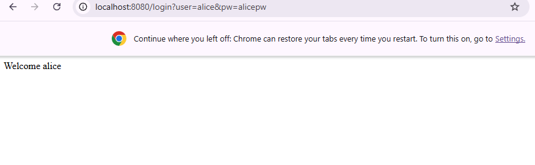
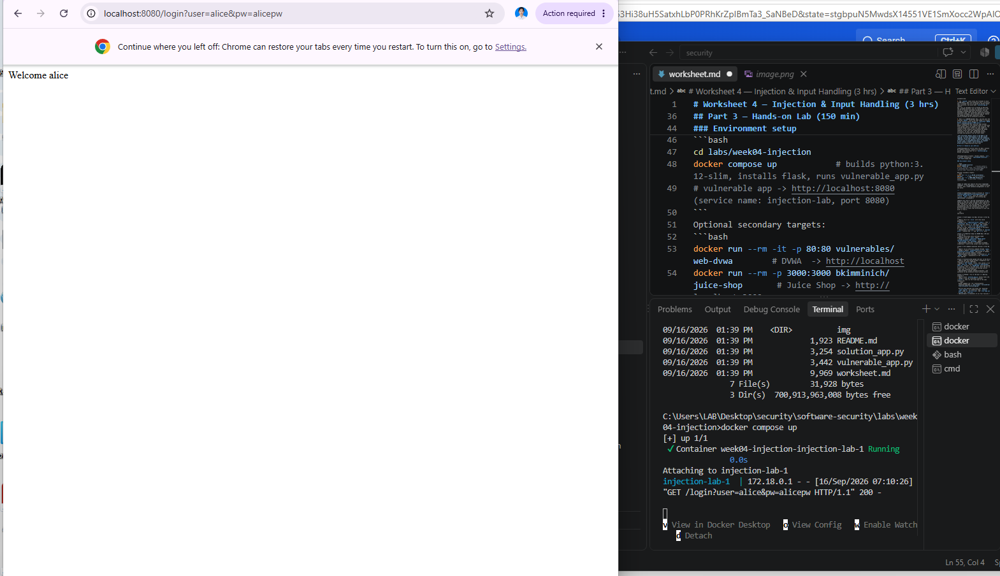
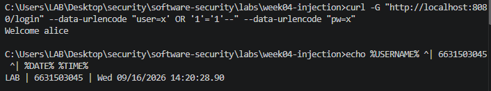
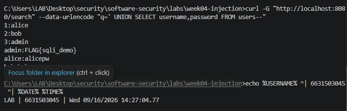
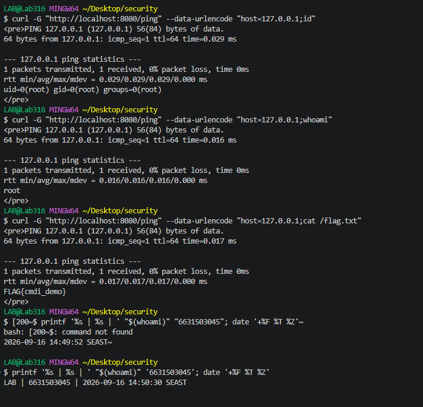
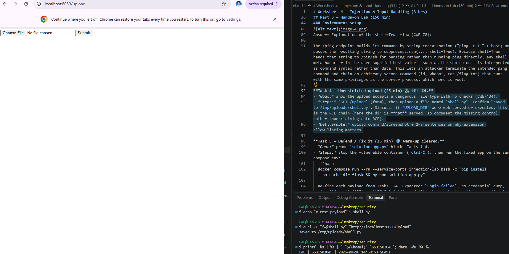
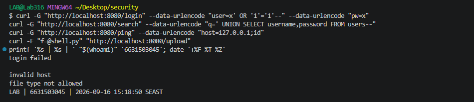

# Worksheet 4 — Injection & Input Handling (3 hrs)

> **Course:** Software Security (KOSEN69) · **Week 4**
> **Aligned:** OWASP 2025 **A05 Injection** · **CWE-89** (SQLi), **CWE-78** (OS command injection), **CWE-434** (unrestricted upload)
> **Signature game:** 🐉 **SQLi Warm-up** — each successful injection lands a "hit"; you clear it when you dump every credential and land an RCE.

> ⚠️ **Ethics note:** All payloads here are for the provided sandbox (`vulnerable_app.py`) and your own DVWA/Juice Shop containers **only**. Never test systems you do not own or have written permission to test. Unauthorized injection is a crime under most computer-misuse laws.

## Part 1 — Student Information

| Name | Student ID | Date | Group |
|Hataichanok Yimjan|6631503045|16/9/2569|-------|
|      |           |      |       |

## Part 2 — Lecture Questions

Answer in 2–4 sentences each.

1. Why does a **parameterized query** (`execute(sql, (params,))`) defeat SQL injection, while string formatting (`"... '%s'" % user`) does not? Reference how the database treats data vs. code.
Ans = A parameterized query separates SQL code from user-provided data. The database treats the parameter as a value rather than SQL syntax, so characters such as quotes cannot change the structure of the query. String formatting directly inserts the input into the SQL statement, allowing the input to become part of the SQL code.

2. In the `/ping` endpoint, `subprocess.run("ping -c 1 " + host, shell=True)` is vulnerable. Explain how `shell=True` turns user input into **CWE-78**, and how an argument array (`["ping","-c","1",host]`) removes the shell.
Ans = With shell=True, the command string is interpreted by the operating system shell. Therefore, special shell characters in the user-controlled host value can cause additional commands to execute. Using an argument array such as ["ping", "-c", "1", host] avoids the shell and passes the host as a separate argument.

3. Distinguish **input validation** (allow-list) from **output handling**. Why is validation alone insufficient defense for SQLi?
Ans = Input validation checks whether incoming data matches an expected format, such as an allow-list of permitted values. Output handling deals with safely displaying or processing data after it has been produced. Validation alone is not a sufficient SQL injection defense because a value that passes validation can still be interpreted as SQL if it is concatenated into a query instead of being parameterized.

4. The `/upload` route saves any filename to disk (**CWE-434**). What two properties must a directory and a filename have for an upload to become remote code execution, and which does `solution_app.py` remove?
Ans = For an uploaded file to become an RCE path, the uploaded directory must be reachable by a web server or another executable mechanism, and the uploaded filename/type must be allowed to contain executable code. The vulnerable application accepts arbitrary filenames, while solution_app.py removes the dangerous path/type conditions using secure_filename and an extension allow-list.

5. What is a **UNION-based** SQLi, and why must the injected `SELECT` return the same number of columns as the original query? Relate to `/search?q=' UNION SELECT username,password FROM users--`.
Ans = A UNION-based SQL injection adds another SELECT statement to the original query so that data from another table can appear in the response. The injected SELECT must return the same number of columns as the original query because SQL UNION combines result sets with compatible column structures. In this lab, the payload selects username and password from the users table


## Part 3 — Hands-on Lab (150 min)

**Learning goals:** extract data via SQLi, achieve OS command injection, exploit an unrestricted upload, then prove each fix in `solution_app.py` blocks the payload.


**Prerequisites:** Docker + Docker Compose, `curl`, a browser. Working dir: `labs/week04-injection/`.


### Environment setup

```bash
cd labs/week04-injection
docker compose up            # builds python:3.12-slim, installs flask, runs vulnerable_app.py
# vulnerable app -> http://localhost:8080   (service name: injection-lab, port 8080)
```
Optional secondary targets:
```bash
docker run --rm -it -p 80:80 vulnerables/web-dvwa        # DVWA  -> http://localhost
docker run --rm -p 3000:3000 bkimminich/juice-shop       # Juice Shop -> http://localhost:3000
```

**What to submit per task:** the exact **payload/command**, a **screenshot** of the response proving success, and a **2–3 sentence mitigation** in your own words.

---

**Task 0 — Onboarding (5 min).** Browse to `http://localhost:8080/login?user=alice&pw=alicepw` and confirm `Welcome alice`. Note the seeded users (`alice`, `bob`). Screenshot the working app. *Deliverable: screenshot.*


**Before you start — see why concatenation is the flaw** 🔬 Type any input and watch which characters the database will parse as *SQL* rather than as a name. The point is not the payload; it is that with concatenation the input becomes syntax, and with a parameterised query it structurally cannot. You will be asked to state that difference in your own words in Task 5.

```sim
sqli-parse
```

**Task 1 — Auth bypass via SQLi (25 min) 🐉 Hit #1.**
- *Goal:* log in as `alice` with **no valid password**.
- *Steps:* hit `/login?user=alice'--&pw=x`, then `/login?user=x' OR '1'='1'--&pw=x` (the trailing `--` is required: without it, SQL binds `AND` tighter than `OR`, so `... OR '1'='1' AND password='x'` matches no row). Observe the comment in the query at lines 61–63 of `vulnerable_app.py`.
- *Deliverable:* both URLs + screenshot of `Welcome alice` + explain why `--` and `OR '1'='1` work.
Answer= The first payload uses -- to comment out the remaining part of the SQL statement, including the password check. The second payload uses OR '1'='1' to make the condition true, and -- removes the remaining password condition from the query. The vulnerability works because the application concatenates the user input directly into the SQL query.


**Task 2 — Credential dump via UNION SQLi (30 min) 🐉 Hit #2.**
- *Goal:* exfiltrate every username **and password** from the `users` table.
- *Steps:* request `/search?q=' UNION SELECT username,password FROM users--`. Confirm `alice:alicepw` and `bob:bobpw` appear.
- *Deliverable:* payload + screenshot of dumped credentials + note on why column count must match.
Answer= A UNION-based SQL injection adds another SELECT statement to the original SQL query. The number of columns must match because the database combines the results of both SELECT statements, and the corresponding columns must have compatible structures.


**Task 3 — OS command injection (30 min) 🐉 Hit #3.**
- *Goal:* run an arbitrary command through `/ping`.
- *Steps:* request `/ping?host=127.0.0.1;id` then `/ping?host=127.0.0.1;whoami` (URL-encode if needed). Capture the injected command's output.
- *Deliverable:* both payloads + screenshot of `id`/`whoami` output + explanation of the `shell=True` flaw (CWE-78).

Answer= Explanation of the shell=True flaw (CWE-78):

The /ping endpoint builds its command by string concatenation ("ping -c 1 " + host) and passes the resulting string to subprocess.run(..., shell=True). Because shell=True hands that string to /bin/sh for parsing rather than running ping directly, any shell metacharacter in the user-supplied host value — such as the semicolon — is interpreted as command syntax rather than data. This lets an attacker terminate the intended ping command and chain an arbitrary second command (id, whoami, cat /flag.txt) that runs with the same privileges as the server process, which here is root.

**Task 4 — Unrestricted upload (25 min) 🐉 Hit #4.**
- *Goal:* show the upload accepts a dangerous file type with no checks (CWE-434).
- *Steps:* `GET /upload` (form), then upload a file named `shell.py`. Confirm `saved to /tmp/uploads/shell.py`. Discuss: if `UPLOAD_DIR` were web-served or executed, this is the RCE chain (here the dir is **not** served, so document the missing control rather than claiming auto-RCE).
- *Deliverable:* upload command/screenshot + 2–3 sentences on why extension allow-listing matters.

Answer=The /upload endpoint accepted shell.py — a server-executable script — with no extension or content-type validation, confirming the file was written as-is to /tmp/uploads/. This is CWE-434: because the upload path has no allow-list, an attacker fully controls both the filename and content of files placed on the server's filesystem. In this lab UPLOAD_DIR is not web-served or executed, so this alone does not achieve RCE — but if that directory were ever exposed via the web server or an execution path, this missing control is exactly what would turn an unrestricted upload into remote code execution.

**Task 5 — Defend / fix it (35 min) 🛡️ Warm-up cleared.**
- *Goal:* prove `solution_app.py` blocks Tasks 1–4.
- *Steps:* stop the vulnerable container (`Ctrl-C`), then run the fixed app on the same compose env:
  ```bash
  docker compose run --rm --service-ports injection-lab bash -c "pip install --no-cache-dir flask && python solution_app.py"
  ```
  Re-fire each payload from Tasks 1–4. Expected: `Login failed`, no credential dump, `invalid host` (400) on `127.0.0.1;id`, and `file type not allowed` for `shell.py`.
- *Deliverable:* screenshots of all four failures + name the fix line for each (parameterized query L52–55 login / L62–66 search, `shell=False`+regex L74–77, `secure_filename`+allow-list L86–93).

Ans= 
| # | Payload | Before (vulnerable_app.py) | After (solution_app.py) | Fix line |
|---|---|---|---|---|
| 1 | `curl -G "http://localhost:8080/login" --data-urlencode "user=x' OR '1'='1'--" --data-urlencode "pw=x"` | `Welcome alice` | `Login failed` | Parameterized query, L52–55 |
| 2 | `curl -G "http://localhost:8080/search" --data-urlencode "q=' UNION SELECT username,password FROM users--"` | Dumped `alice:alicepw`, `bob:bobpw` | No output / no credential leak | Parameterized query, L62–66 |
| 3 | `curl -G "http://localhost:8080/ping" --data-urlencode "host=127.0.0.1;id"` | `id`/`whoami` output, `/flag.txt` dumped | `invalid host` (400) | `shell=False` + regex validation, L74–77 |
| 4 | `curl -F "f=@shell.py" "http://localhost:8080/upload"` | `saved to /tmp/uploads/shell.py` | `file type not allowed` | `secure_filename` + extension allow-list, L86–93 |

*Evidence:* Screenshot shows all four payloads and their failure responses, plus the identity stamp `LAB \| 6631503045 \| 2026-09-16 15:18:50 SEAST` in the same terminal window.

*Deliverable:* Screenshot of all four failures + fix lines above.

## Part 4 — Reflection

1. **CWE/OWASP mapping:** map each of your four exploits to its CWE (89/78/434) and to OWASP 2025 **A05 Injection**.
Ans = | Task | Exploit | CWE | OWASP 2025 category |
|---|---|---|---|
| 1 & 2 | Auth bypass (`' OR '1'='1'--`) and UNION-based credential dump | **CWE-89** (SQL Injection) | **A05 Injection** — untrusted input concatenated directly into a SQL query, changing its parse tree |
| 3 | OS command injection via `/ping?host=...;id` | **CWE-78** (OS Command Injection) | **A05 Injection** — untrusted input concatenated into a string passed to `shell=True`, changing what the shell parses as commands vs. data |
| 4 | Unrestricted upload of `shell.py` | **CWE-434** (Unrestricted Upload of File with Dangerous Type) | **A05 Injection** (broadly: untrusted input reaching a sink — the filesystem — with no allow-list on type/content) |

All three share the same root cause: untrusted request data reaches a powerful interpreter (SQL engine, OS shell, filesystem writer) without being separated from that interpreter's control/command channel — which is exactly what OWASP's A05 Injection category covers.

2. **Real breach:** the **2017 Equifax breach** exposed ~147M people after attackers exploited a known input-handling flaw (Apache Struts CVE-2017-5638). In 3–4 sentences, connect that failure to the lessons in this lab (untrusted input reaching a powerful interpreter; the cost of an unpatched/unvalidated input path).
Ans = The Equifax breach happened because attackers exploited a known, unpatched deserialization flaw in Apache Struts (CVE-2017-5638) that let a malicious HTTP header reach the OS as an executable command — the same CWE-78 pattern as Task 3's `/ping` endpoint, just with a different entry point. In both cases, untrusted input from a request was allowed to reach a powerful interpreter (the OS shell) without validation, giving the attacker a way to execute arbitrary commands rather than just supply data. The difference in scale — a lab flag vs. ~147 million people's PII — shows that the *mechanism* of an injection flaw doesn't change with the size of the system; only the blast radius does. Equifax also had a patch available for months before the breach, which mirrors Task 5's lesson: the fix (input separated from the interpreter, or in Equifax's case, an available patch) only protects you if it's actually applied — an unvalidated or unpatched input path is a standing liability, not a one-time risk.

3. **Best mitigation:** of parameterized queries, allow-list validation, least privilege, and avoiding `shell=True`, which single control would have prevented the most damage in this lab, and why?
Ans = 
**Parameterized queries / avoiding `shell=True`** (i.e., keeping data structurally separate from the interpreter, rather than relying on filtering it) would have prevented the most damage in this lab. Allow-list validation and least privilege are valuable defense-in-depth, but they're still pattern-matching against known-bad input — an allow-list can be incomplete, and a least-privilege account still leaks whatever data it *is* allowed to touch (as seen in Task 2's UNION dump, which didn't need `id`/`whoami`-level access at all). Structural separation (parameterized queries, `shell=False` + argument vectors) removes the *category* of attack entirely rather than trying to catch every malicious variant of it, which is why it stopped both the SQLi and the command injection in Task 5 without needing to anticipate specific payloads.

## Grading rubric (100)

| Criterion | Points |
|-----------|-------:|
| Part 2 — Lecture questions (conceptual accuracy) | 20 |
| Part 3 — Exploitation + evidence (payloads + screenshots, Tasks 1–4) | 40 |
| Part 3 — Defense (Task 5: fixes proven, lines cited) | 25 |
| Part 4 — Reflection (CWE/OWASP mapping, breach, mitigation) | 15 |
| **Total** | **100** |

---

## Evidence & Integrity (required)

- **Identity proof:** every screenshot/diagram must show a terminal running `printf '%s | %s | ' "$(whoami)" '<YOUR-STUDENT-ID>'; date '+%F %T %Z'` **in the
  same image as the evidence**. When the evidence is a browser page, a DevTools panel or a
  rendered response, put that terminal **beside the browser and capture the whole screen** — a
  cropped window carries nothing that identifies you, and the lab's own output is
  byte-identical for the whole cohort *by design*, so the stamp is the only thing that makes
  the shot yours. Generic or borrowed evidence is not accepted.
- **Personalized flag (if this lab issues one):** ____________________
  *Flags are unique per student — submitting another student's flag is a violation. This blank is a
  record for your worksheet PDF only — the flag is actually **scored** by submitting it in the
  arena challenge itself at **ctf.zcr.ai**. (Worksheet PDF → **learn.zcr.ai/submit**; full guide:
  `SUBMISSION.md` in the repo root.)*
- **Explain in your own words** *(graded on your reasoning, not copied text):*
  1. What did you do, and **why did the vulnerability work**?
  Ans = Across Tasks 1–4, I sent crafted input to four different endpoints (`/login`, `/search`, `/ping`, `/upload`) that each took a value straight from the request and used it to build a command or write a file without separating that value from the surrounding syntax. In `/login` and `/search`, my input (`' OR '1'='1'--`, the UNION payload) became part of the SQL query itself because the app concatenated it into a string instead of passing it as a parameter — the database couldn't tell "my input" apart from "the query's own code." In `/ping`, the same problem happened one layer down: my `;id` was concatenated into a string handed to the OS shell with `shell=True`, so the shell read the semicolon as "end this command, start a new one." In `/upload`, there was no injection at all — the endpoint just never checked what type of file it was saving, so an executable script (`shell.py`) went onto disk unchecked. In every case, the underlying reason was the same: the app trusted that the input would only ever be *data*, and never verified or structurally separated it from being treated as *instructions*.
  
  2. **Why does your fix actually stop it** — and what could still break it?
  Ans =The fix works because it stops relying on the input "behaving" and instead removes the interpreter's ability to misread it. Parameterized queries (Tasks 1 & 2) send the query template and the user's values to the database through separate channels, so no string of characters — quotes, dashes, anything — can ever be parsed as SQL syntax; the database always treats it as a literal value. `shell=False` with an argument array (Task 3) does the same thing for the OS: the host string is delivered to `ping` as one fixed argument, never handed to a shell to parse, so `;id` can't be interpreted as "a new command." The upload fix (Task 4) adds what was missing — an actual allow-list check — so a `.py` file is rejected outright regardless of its filename or content.

What could still break it: the SQL and command-injection fixes only hold as long as *every* code path that touches user input goes through the same parameterized/argument-vector pattern — a single endpoint added later that reverts to string concatenation reopens the same hole. The upload fix depends entirely on the allow-list being complete and correctly enforced (e.g., checking the real file content/magic bytes, not just the extension, since a renamed file could otherwise bypass an extension-only check) and on `UPLOAD_DIR` continuing to never be web-served or executed — if that assumption changes later, the same missing-content-check gap becomes exploitable again.

---

## 🤖 Audit the AI (required)

AI is a power tool you must **distrust** — you are graded on your *critique*, not the AI's answer.

1. Ask an AI assistant to exploit **or** fix this week's vulnerability. Paste its full answer.
Ans =  Use a parameterized query instead of string formatting. For `sqlite3`-style drivers: `cursor.execute("SELECT * FROM users WHERE user=? AND password=?", (user, password))`. For `psycopg2`/`mysql-connector`: use `%s` placeholders instead. The driver safely escapes the value (or sends it separately to the database engine) instead of embedding user input into the SQL text. Don't just escape quotes manually — still bypassable.

2. **Find what's wrong or risky** in it — insecure code, a subtly incomplete fix, a hallucinated API/function/CVE, a missed edge case, or wrong reasoning. Quote the exact line(s).
Ans = 
The fix itself is correct, but two issues:
- *"The driver safely escapes the value (or sends it separately)"* wrongly treats escaping and parameter binding as equivalent. They aren't — binding never puts the value in the SQL text at all, which is *why* it's safe. Calling it "escaping" undercuts the answer's own warning against manual escaping.
- It gives two placeholder syntaxes (`?` vs `%s`) without checking which the actual database uses. This lab runs `sqlite3`, which needs `?` — the `%s` version would raise `sqlite3.ProgrammingError` if copy-pasted here.

3. Produce the **correct, verified** version yourself and explain in 2–3 sentences why the AI's output was insufficient.
Ans= 
```python
cur.execute("SELECT * FROM users WHERE user=? AND password=?", (user, password))
```

Matches `solution_app.py` L52–55. Verified in Task 5: `x' OR '1'='1'--` now returns `Login failed`. The AI's answer was insufficient because it blurred *why* parameterization is safe and wasn't checked against the lab's actual `sqlite3` backend.

> Disclose your AI use in the Part 1 table. This task counts toward your **Defense + Reflection** score.

---

## 🧠 Comprehension & Prompt (required)

**A. Explain in Plain English (EiPE).** In 2–3 sentences, in your own words, describe what this week's vulnerable code/endpoint actually *does* and *why it is exploitable* — explain the mechanism, don't dump jargon.
Ans = The `/login`, `/search`, and `/ping` endpoints all build a command by pasting raw user input directly into a string, then hand that string to something that interprets it as code — a database engine or the OS shell. Because the input isn't kept separate from the command's own syntax, characters like `'`, `;`, or `--` let an attacker change what the command actually does instead of just filling in a value. `/upload` is a simpler case: there's no interpreter being tricked, just a missing check — it saves whatever file is sent with no verification of its type. 

**B. Prompt Problem.** Write a **single prompt** that makes an AI produce a *correct, secure* fix for one finding. Run it: does the exploit now fail? If not, refine the prompt and try again. Submit the **final prompt + the verified result**.
Ans = > "Fix this SQL injection vulnerability in my Flask app: `query = "SELECT * FROM users WHERE user='%s' AND password='%s'" % (user, password)`. Show me the corrected code."

*Verified result:* The AI returned a parameterized query (`cursor.execute("SELECT * FROM users WHERE user=? AND password=?", (user, password))`), matching the actual fix in `solution_app.py` (L52–55). I tested it directly: re-firing `x' OR '1'='1'--` against the fixed `/login` endpoint returned `Login failed` instead of `Welcome alice`, confirming the exploit no longer works.
*Graded on the prompt's precision and your verification — this trains problem decomposition and AI literacy (Denny et al. 2024).*
