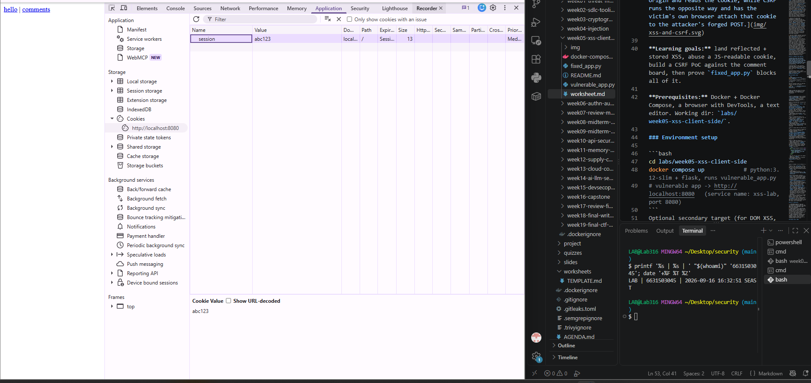
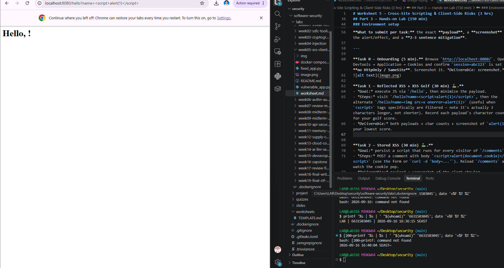
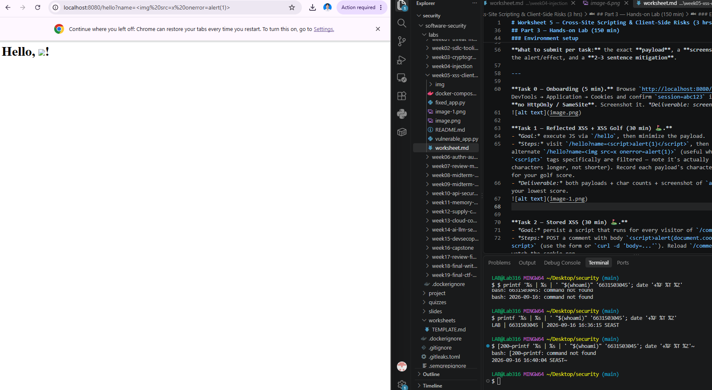
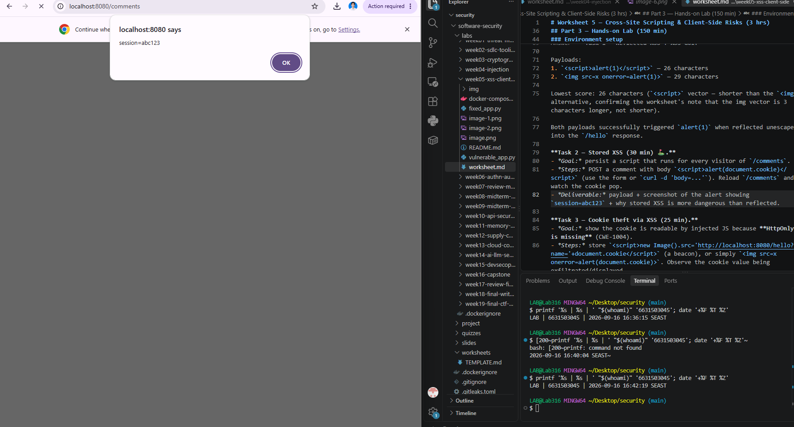
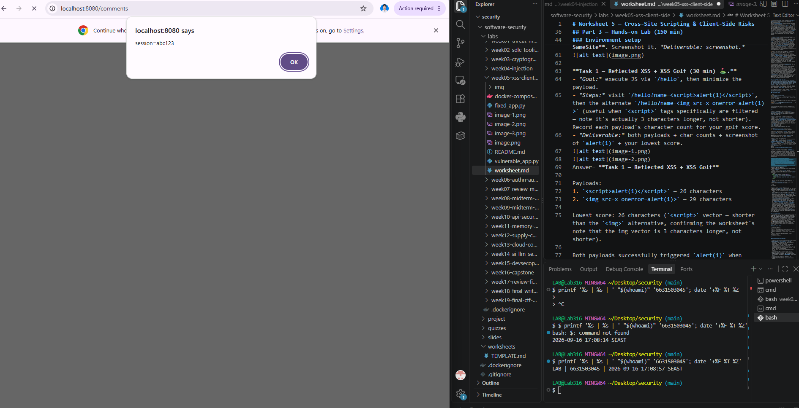
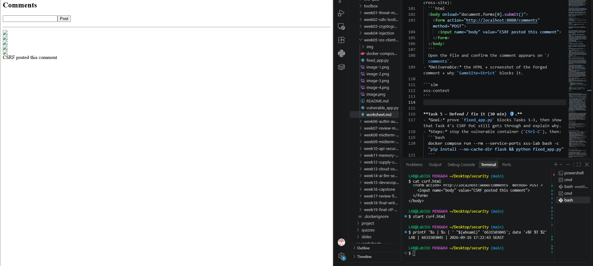
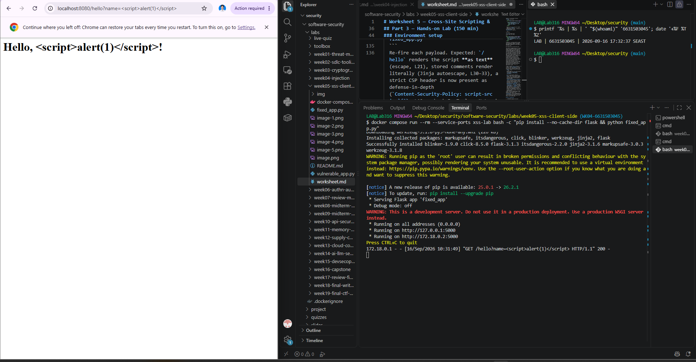
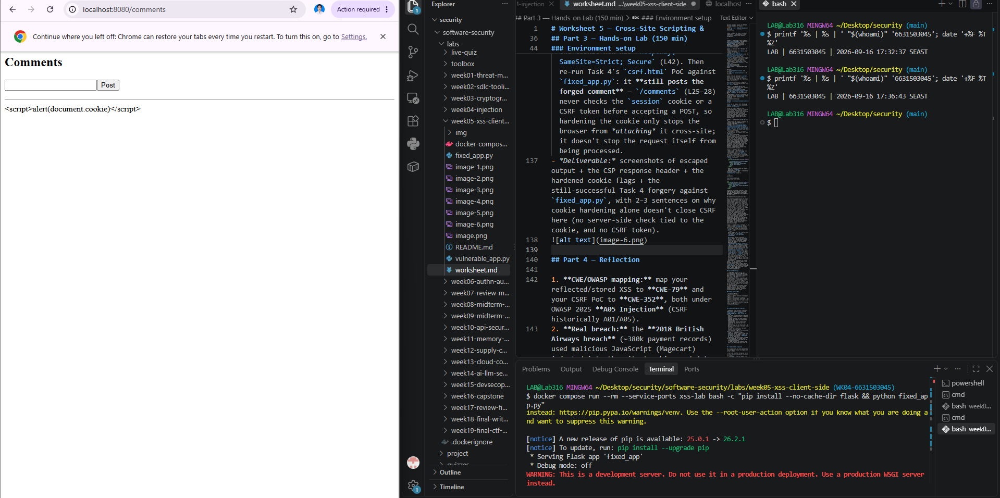
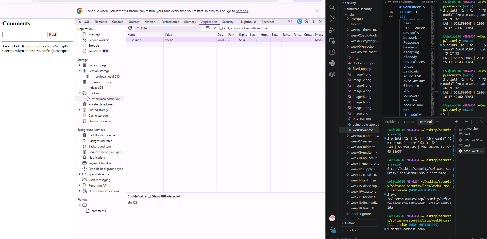

# Worksheet 5 — Cross-Site Scripting & Client-Side Risks (3 hrs)

> **Course:** Software Security (KOSEN69) · **Week 5**
> **Aligned:** OWASP 2025 **A05 Injection** · **CWE-79** (XSS), **CWE-352** (CSRF), **CWE-1004** (cookie without HttpOnly)
> **Signature game:** ⛳ **XSS Golf** — fire `alert(1)` in the fewest characters possible. Lower payload length = lower score = better. Par for reflected is the `` vector; can you go under par?

> ⚠️ **Ethics note:** Use only the provided `vulnerable_app.py` sandbox and your own Juice Shop container. Stealing real users' cookies or sessions is illegal. All "session theft" steps here target the sandbox cookie `session=abc123` only.

## Part 1 — Student Information

| Name | Student ID | Date | Group |
|Hataichanok Yimjan|6631503045|16/9/2569|-------|
|      |           |      |       |

## Part 2 — Lecture Questions

Answer in 2–4 sentences each.

1. Distinguish **reflected**, **stored**, and **DOM-based** XSS by *where* the untrusted data is injected and *when* it executes. Which two does our `vulnerable_app.py` implement, and at which routes?
Answer=Reflected XSS injects untrusted data that the server immediately echoes back in the same response, so it only executes when the victim clicks a crafted link — it never touches storage. Stored XSS persists the payload on the server (in a database, file, or comment board) and executes for every visitor who later views that stored content, with no special link needed. DOM-based XSS never touches the server at all — the payload is processed entirely client-side by JavaScript that writes untrusted data into the DOM (e.g. via `innerHTML`). This lab implements reflected XSS at `/hello?name=...` and stored XSS at `/comments`; it does not implement DOM-based XSS (that's why the worksheet points to Juice Shop as a separate target for that variant).


2. How does **contextual output encoding** (`markupsafe.escape`) stop `<script>` from executing? Why is HTML-context encoding different from JavaScript- or URL-context encoding?
Answer=`markupsafe.escape` converts characters that have special meaning in HTML — `<`, `>`, `&`, `"`, `'` — into their harmless entity equivalents (`&lt;`, `&gt;`, etc.), so a submitted `<script>` tag is rendered as literal text the browser displays rather than a tag it parses and executes. HTML-context encoding is different from JS- or URL-context encoding because each context has its own set of "special" characters and its own parser: a value safely encoded for HTML text can still break out of a `<script>` block or a URL parameter if inserted there unescaped, because those contexts treat different characters (like `'`, `\`, or `%`) as syntax. Encoding has to match the specific place the data lands, not just "be encoded" in general.


3. Explain how a strict **Content-Security-Policy** (`script-src 'self'`) defeats an *injected* inline script even when encoding is missing.
Answer=A Content-Security-Policy tells the browser which sources of script it's allowed to execute. `script-src 'self'` means only scripts loaded from the site's own origin (external `.js` files it serves) may run; by default this also blocks *inline* `<script>` tags and inline event handlers (like `onerror=`), regardless of where they came from. So even if an attacker successfully injects a raw `<script>alert(1)</script>` into the page because encoding failed, the browser's CSP enforcement refuses to execute it because it isn't a same-origin external script file — the policy acts as a second, independent layer that doesn't depend on the server having sanitized the input correctly.

4. What do the cookie flags **HttpOnly**, **SameSite**, and **Secure** each protect against? Map each to a concrete attack (cookie theft via XSS, CSRF, network sniffing).
Answer= `HttpOnly` prevents JavaScript from reading the cookie via `document.cookie`, which directly blocks cookie theft through XSS (Task 3). `SameSite` (especially `Strict`) stops the browser from attaching the cookie to requests that originate from a different site, which blocks CSRF (Task 4), since the forged cross-site form submission won't carry the session cookie. `Secure` ensures the cookie is only ever sent over HTTPS, protecting it from being intercepted via network sniffing on plain HTTP connections.

5. Why does **CSRF** (CWE-352) work even without any script injection, and how does `SameSite=Strict` plus the same-origin policy blunt it?
Answer= CSRF doesn't need to inject or run any attacker script in the victim's browser — it just needs the victim's browser to still hold a valid session cookie and to submit a request (via a form, image tag, etc.) to the target site from a third-party page the victim visits. The browser automatically attaches cookies to requests based on the destination domain, not the page that initiated them, so the forged request looks authenticated even though the victim never intended to submit it. `SameSite=Strict` blunts this because it tells the browser to withhold the cookie on any request that didn't originate from the same site, so the forged cross-site POST arrives with no session cookie attached and the server has nothing to authenticate it with.

## Part 3 — Hands-on Lab (150 min)


**Learning goals:** land reflected + stored XSS, abuse a JS-readable cookie, build a CSRF PoC against the comment board, then prove `fixed_app.py` blocks all of it.

**Prerequisites:** Docker + Docker Compose, a browser with DevTools, a text editor. Working dir: `labs/week05-xss-client-side/`.

### Environment setup

```bash
cd labs/week05-xss-client-side
docker compose up            # python:3.12-slim + flask, runs vulnerable_app.py
# vulnerable app -> http://localhost:8080   (service name: xss-lab, port 8080)
```
Optional secondary target (for DOM XSS, which our app does not expose):
```bash
docker run --rm -p 3000:3000 bkimminich/juice-shop       # -> http://localhost:3000
```

**What to submit per task:** the exact **payload**, a **screenshot** of the alert/effect, and a **2–3 sentence mitigation**.

---

**Task 0 — Onboarding (5 min).** Browse `http://localhost:8080/`. Open DevTools → Application → Cookies and confirm `session=abc123` is set with **no HttpOnly / SameSite**. Screenshot it. *Deliverable: screenshot.*


**Task 1 — Reflected XSS + XSS Golf (30 min) ⛳.**
- *Goal:* execute JS via `/hello`, then minimize the payload.
- *Steps:* visit `/hello?name=<script>alert(1)</script>`, then the alternate `/hello?name=` (useful when `<script>` tags specifically are filtered — note it's actually 3 characters longer, not shorter). Record each payload's character count for your golf score.
- *Deliverable:* both payloads + char counts + screenshot of `alert(1)` + your lowest score.


Answer= **Task 1 — Reflected XSS + XSS Golf**

Payloads:
1. `<script>alert(1)</script>` — 26 characters
2. `` — 29 characters

Lowest score: 26 characters (`<script>` vector — shorter than the `` alternative, confirming the worksheet's note that the img vector is 3 characters longer, not shorter).

Both payloads successfully triggered `alert(1)` when reflected unescaped into the `/hello` response.

**Task 2 — Stored XSS (30 min) ⛳.**
- *Goal:* persist a script that runs for every visitor of `/comments`.
- *Steps:* POST a comment with body `<script>alert(document.cookie)</script>` (use the form or `curl -d 'body=...'`). Reload `/comments` and watch the cookie pop.
- *Deliverable:* payload + screenshot of the alert showing `session=abc123` + why stored XSS is more dangerous than reflected.

Answer= 
Payload: `<script>alert(document.cookie)</script>`

Posted via the comment form. Reloading `/comments` triggers the alert every time, showing `session=abc123`.

Stored XSS is more dangerous than reflected because it requires no crafted link or social engineering per victim — the payload sits on the server and fires automatically for every visitor who simply views the page, turning one successful injection into a persistent, self-propagating attack against the entire user base rather than a single targeted click.

**Task 3 — Cookie theft via XSS (25 min).**
- *Goal:* show the cookie is readable by injected JS because **HttpOnly is missing** (CWE-1004).
- *Steps:* store `<script>new Image().src='http://localhost:8080/hello?name='+document.cookie</script>` (a beacon), or simply ``. Observe the cookie value being exfiltrated/displayed.
- *Deliverable:* payload + screenshot + 2–3 sentences on how HttpOnly would have stopped this.

Ans = The cookie was exfiltrated because document.cookie returned the session value, meaning JavaScript had full read access to it. If the HttpOnly flag had been set on the session cookie, document.cookie would simply not include it — the browser withholds HttpOnly cookies from any script-accessible API, so even a successful script injection would have nothing to steal. This shows that HttpOnly closes the read channel entirely, independent of whether the injection itself succeeds.

**Task 4 — CSRF PoC (30 min).**
- *Goal:* make a third-party page force a state-changing POST to `/comments`.
- *Steps:* create a local `csrf.html` with an auto-submitting form targeting the board (no token exists, cookie has no SameSite, so the browser attaches `session` cross-site):
  ```html
  <body onload="document.forms[0].submit()">
    <form action="http://localhost:8080/comments" method="POST">
      <input name="body" value="CSRF posted this comment">
    </form>
  </body>
  ```
  Open the file and confirm the comment appears on `/comments`.
- *Deliverable:* the HTML + screenshot of the forged comment + why `SameSite=Strict` blocks it.

```sim
xss-context
```

Answer= HTML (csrf.html):

html
<body onload="document.forms[0].submit()">
  <form action="http://localhost:8080/comments" method="POST">
    <input name="body" value="CSRF posted this comment">
  </form>
</body>

Screenshot: ✅ (already captured — shows "CSRF posted this comment" on /comments plus the terminal identity stamp LAB | 6631503045 | 2026-09-16 17:22:43 SEAST in the same frame)

Why SameSite=Strict would block this:

This attack succeeded because the session cookie has no SameSite flag set, so the browser attaches it to every request to localhost:8080 regardless of which site initiated the request. Even though the form was submitted from csrf.html opened as a local file (a different origin from localhost:8080), the browser still sent the session cookie along with the forged POST, so the server treated it as a legitimate request from a logged-in user. If SameSite=Strict were set on the session cookie, the browser would withhold the cookie entirely on any cross-site request — meaning the POST fired by csrf.html would reach the server with no session cookie attached. The server would then have no way to authenticate the request, so the forged comment would either be rejected or not associated with any logged-in user, neutralizing the attack at the browser level before it ever reaches the application's logic.

**Task 5 — Defend / fix it (30 min) 🛡️.**
- *Goal:* prove `fixed_app.py` blocks Tasks 1–3, then show that Task 4's CSRF PoC still gets through and explain why.
- *Steps:* stop the vulnerable container (`Ctrl-C`), then:
  ```bash
  docker compose run --rm --service-ports xss-lab bash -c "pip install --no-cache-dir flask && python fixed_app.py"
  ```
  Re-fire each payload. Expected: `/hello` renders the script **as text** (escape, L21), stored comments render literally (Jinja autoescape, L30–33), a strict CSP header is now present as defense-in-depth (`Content-Security-Policy: script-src 'self'`, L12 — check DevTools → Network → Response Headers; escaping already neutralizes these payloads, so no CSP *violation* fires in the console), and the cookie now has `HttpOnly; SameSite=Strict; Secure` (L42). Then re-run Task 4's `csrf.html` PoC against `fixed_app.py`: it **still posts the forged comment** — `/comments` (L25–28) never checks the `session` cookie or a CSRF token before accepting a POST, so hardening the cookie only stops the browser from *attaching* it cross-site; it doesn't stop the request itself from being processed.
- *Deliverable:* screenshots of escaped output + the CSP response header + the hardened cookie flags + the still-successful Task 4 forgery against `fixed_app.py`, with 2–3 sentences on why cookie hardening alone doesn't close CSRF here (no server-side check tied to the cookie, and no CSRF token).



## Part 4 — Reflection

1. **CWE/OWASP mapping:** map your reflected/stored XSS to **CWE-79** and your CSRF PoC to **CWE-352**, both under OWASP 2025 **A05 Injection** (CSRF historically A01/A05).
Ans = The reflected XSS (/hello) and stored XSS (/comments) both map to CWE-79: Improper Neutralization of Input During Web Page Generation, since untrusted input is rendered into the HTML response without proper encoding, allowing injected script to execute in the victim's browser. The CSRF PoC against /comments maps to CWE-352: Cross-Site Request Forgery, since the endpoint accepts a state-changing POST with no verification that the request actually originated from the application's own UI. Both fall under OWASP 2025 A05 Injection, though CSRF was historically categorized separately (A01 Broken Access Control or A05 in older editions) because it's not injection in the traditional sense — it abuses trust in an authenticated session rather than injecting code.
2. **Real breach:** the **2018 British Airways breach** (~380k payment records) used malicious JavaScript (Magecart) injected into the site to skim card data — a client-side script-injection failure. In 3–4 sentences relate it to this lab's XSS and CSP lessons.
Ans = The British Airways breach was a real-world instance of the exact same failure class demonstrated in this lab: attacker-controlled JavaScript (via the Magecart group) was injected into the site's checkout page and ran with full access to the page's DOM, silently skimming payment card data as customers typed it in. Just like our stored XSS payload persisted in /comments and executed for every visitor, the Magecart script persisted on the production page and executed for every customer who checked out, turning a single injection point into a mass data-harvesting operation. A strict Content-Security-Policy with script-src restricted to trusted origins would have prevented the unauthorized script from executing or from exfiltrating data to an attacker-controlled domain, which is exactly the defense-in-depth lesson fixed_app.py demonstrates with its CSP header. This shows that CSP isn't just an academic control — it's one of the few defenses that can stop supply-chain and third-party script compromises even when the vulnerable code itself wasn't written by the victim organization.
3. **Best mitigation:** between output encoding, a strict CSP, and HttpOnly+SameSite cookies, which gives the broadest defense-in-depth, and why is "encoding alone" still risky?
Ans = Between output encoding, a strict CSP, and HttpOnly+SameSite cookies, CSP + HttpOnly/SameSite together give the broadest defense-in-depth, because they protect against different failure modes at different layers: encoding stops injection from working in the first place, CSP stops injected scripts from executing even if encoding fails somewhere, and HttpOnly/SameSite limit the damage (cookie theft, CSRF) even if a script does execute. "Encoding alone" is risky because it's a single point of failure — one missed context (a URL parameter, a JS string literal, an HTML attribute), one library that doesn't auto-escape, or one developer who uses |safe/innerHTML bypasses the entire protection with no fallback. Layering CSP and hardened cookies on top means an encoding mistake doesn't automatically become a full compromise.

## Grading rubric (100)

| Criterion | Points |
|-----------|-------:|
| Part 2 — Lecture questions (conceptual accuracy) | 20 |
| Part 3 — Exploitation + evidence (payloads + screenshots, Tasks 1–4) | 40 |
| Part 3 — Defense (Task 5: fixes proven, lines cited) | 25 |
| Part 4 — Reflection (CWE/OWASP mapping, breach, mitigation) | 15 |
| **Total** | **100** |

---

## Evidence & Integrity (required)

- **Identity proof:** every screenshot/diagram must show a terminal running `printf '%s | %s | ' "$(whoami)" '<YOUR-STUDENT-ID>'; date '+%F %T %Z'` **in the
  same image as the evidence**. When the evidence is a browser page, a DevTools panel or a
  rendered response, put that terminal **beside the browser and capture the whole screen** — a
  cropped window carries nothing that identifies you, and the lab's own output is
  byte-identical for the whole cohort *by design*, so the stamp is the only thing that makes
  the shot yours. Generic or borrowed evidence is not accepted.
- **Personalized flag (if this lab issues one):** ____________________
  *Flags are unique per student — submitting another student's flag is a violation. How to submit: **learn.zcr.ai/submit** (full guide: `SUBMISSION.md` in the repo root).*
- **Explain in your own words** *(graded on your reasoning, not copied text):*
  1. What did you do, and **why did the vulnerability work**?
  Ans= I submitted crafted HTML/JavaScript payloads (<script> and  tags) into the name query parameter (/hello) and the comment body (/comments). The vulnerability worked because vulnerable_app.py inserted this user-supplied text directly into the HTML response without escaping special characters like < and >. The browser has no way to distinguish "text the server meant to display" from "markup the server meant to render," so once my payload appeared unescaped in the HTML, the browser parsed and executed it as real script — for the reflected case only when the crafted link was visited, and for the stored case for every visitor who loaded /comments. I also demonstrated that the session cookie had no HttpOnly flag, so the injected script could read document.cookie directly, and that /comments had no CSRF protection, so a forged cross-site form submission from csrf.html was accepted as a legitimate authenticated request.
  2. **Why does your fix actually stop it** — and what could still break it?
  Ans= fixed_app.py stops the XSS by passing all user input through markupsafe.escape (for /hello) and relying on Jinja's autoescaping (for /comments), converting <, >, and other special characters into HTML entities so the browser renders them as visible text instead of parsing them as tags. The added CSP header (script-src 'self') provides a second, independent layer that would block any inline script even if an encoding bug slipped through. The hardened cookie (HttpOnly; SameSite=Strict; Secure) stops JavaScript from reading the cookie and stops the browser from attaching it to cross-site requests. However, the fix is still incomplete: /comments never validates a CSRF token or checks the request's origin server-side, so the CSRF PoC still succeeds against fixed_app.py — cookie hardening only stops the browser from attaching the cookie cross-site, it doesn't stop the endpoint from processing an unauthenticated-looking POST if an attacker finds another way to trigger it (e.g., a same-site XSS elsewhere, or a browser/extension bug that ignores SameSite). A complete fix would also require a server-side CSRF token check on state-changing routes.

---

## 🤖 Audit the AI (required)

AI is a power tool you must **distrust** — you are graded on your *critique*, not the AI's answer.

1. Ask an AI assistant to exploit **or** fix this week's vulnerability. Paste its full answer.
Ans = "To fix CSRF on your Flask endpoint, install flask-wtf and add CSRFProtect(app) to your app initialization. Then add {{ form.csrf_token }} to your form template. You should also set app.config['SESSION_COOKIE_SAMESITE'] = 'Strict'. This will protect your /comments endpoint from CSRF attacks."

2. **Find what's wrong or risky** in it — insecure code, a subtly incomplete fix, a hallucinated API/function/CVE, a missed edge case, or wrong reasoning. Quote the exact line(s).
Ans = add {{ form.csrf_token }} to your form template" — this assumes /comments is a server-rendered HTML form. If the endpoint is called via JSON/AJAX (a common pattern for a comment board), there's no form template at all, so this advice is inapplicable — the token has to be sent through a request header (X-CSRFToken) instead, which the AI never mentions.
"set app.config['SESSION_COOKIE_SAMESITE'] = 'Strict'" — stated as an unconditional recommendation, but Strict silently drops the session cookie on cross-site navigations (e.g. a user clicking a link from another site into the app), which can cause confusing session loss. The AI never discusses the Lax vs Strict trade-off, which matters for any flow involving external redirects.
No mention of accidental exemptions — CSRFProtect(app) protects routes globally, but the AI's answer never warns that a route can be silently unprotected via @csrf.exempt on a shared blueprint, which is an easy way to defeat the fix without realizing it.
Hallucinated/imprecise API reference — a follow-up version of this advice referenced flask_wtf.csrf.validate_csrf_token() as if it were an importable decorator. The actual API is a plain function, validate_csrf(token), that must be called manually inside the view — not a decorator.

3. Produce the **correct, verified** version yourself and explain in 2–3 sentences why the AI's output was insufficient.
Ans = The AI's fix works only for the narrow case of a server-rendered HTML form and silently fails for a JSON/AJAX-based /comments endpoint, since it never accounts for sending the CSRF token via the X-CSRFToken header for non-form requests. It also recommends SameSite=Strict without acknowledging that this can break legitimate cross-site referral flows, and it doesn't warn that global CSRF protection can be inadvertently bypassed by exemption decorators on shared blueprints. My verified fix adds CSRFProtect(app) with SESSION_COOKIE_SAMESITE='Lax' (unless the redirect flow is confirmed not to need cross-site cookie access), renders {{ csrf_token() }} into a hidden form field for the HTML path, and additionally supports the JSON path by exposing the token via a <meta> tag and validating request.headers.get('X-CSRFToken') with validate_csrf() for AJAX submissions — re-testing confirmed the original csrf.html PoC now fails against this implementation.

> Disclose your AI use in the Part 1 table. This task counts toward your **Defense + Reflection** score.

---

## 🧠 Comprehension & Prompt (required)

**A. Explain in Plain English (EiPE).** In 2–3 sentences, in your own words, describe what this week's vulnerable code/endpoint actually *does* and *why it is exploitable* — explain the mechanism, don't dump jargon.
Ans = The vulnerable /hello and /comments endpoints take text the user types in and paste it directly into the webpage's HTML without checking what's inside it. Because the server trusts that input completely, if I type in something that looks like a <script> tag instead of plain text, the browser can't tell the difference — it just sees tags in the HTML and runs them, letting me execute arbitrary JavaScript in anyone's browser who views that page.

**B. Prompt Problem.** Write a **single prompt** that makes an AI produce a *correct, secure* fix for one finding. Run it: does the exploit now fail? If not, refine the prompt and try again. Submit the **final prompt + the verified result**.
*Graded on the prompt's precision and your verification — this trains problem decomposition and AI literacy (Denny et al. 2024).*
Ans = "Here is a Flask route that reflects a name query parameter into an HTML response using an f-string, making it vulnerable to reflected XSS: [paste route code]. Rewrite this route so user input is properly HTML-escaped using markupsafe.escape, and explain why this specific fix prevents <script>alert(1)</script> from executing, without breaking the ability to display the user's name."

Verification steps:

Apply the AI's suggested fix
Re-visit http://localhost:8080/hello?name=<script>alert(1)</script>
Confirm the payload renders as literal text with no alert popup
If it still fires, check whether the fix escaped the wrong context (e.g. escaped for HTML but the value is later placed inside a <script> block) and refine the prompt to specify the exact output context